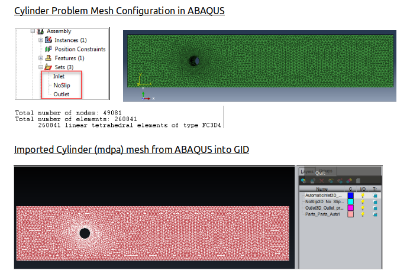
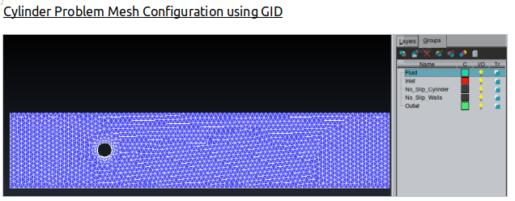
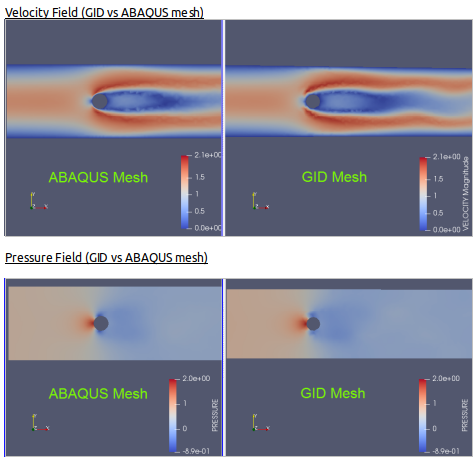
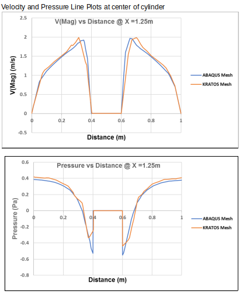
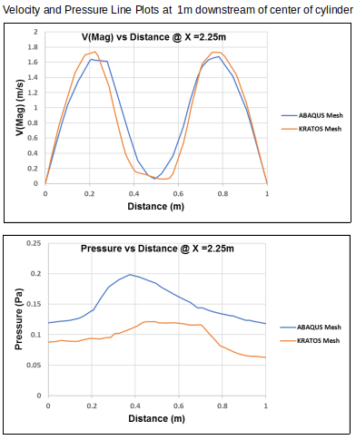

# ABAQUS2KRATOS (CFD Mesh Parsing Tool)

## Wiki

Coming Soon.... 

----------------------------------------------------------------------------------------------
## Test Cases

The python script mesh parsing Tool has been tested for a flow around cylinder problem.

The results are compared with a similar case using the default mesh generation tool in GID 
 

----------------------------------------------------------------------------------------------
### Cylinder Problem Mesh Configuration in ABAQUS and GID:

----------------------------------------------------------------------------------------------

### Cylinder Problem Results Comparison (Velocity and Pressure fields):

----------------------------------------------------------------------------------------------